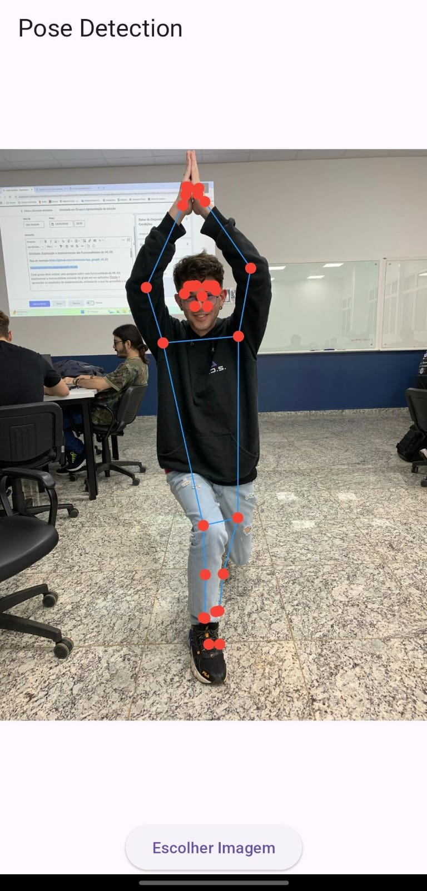

# pose_detection

App que detecta poses em foto



## Rodando o projeto

### Baixando dependências
```bash
    flutter pub get
```

### Rodando o projeto
```bash
    flutter run -d <id_dispositivo>
```
